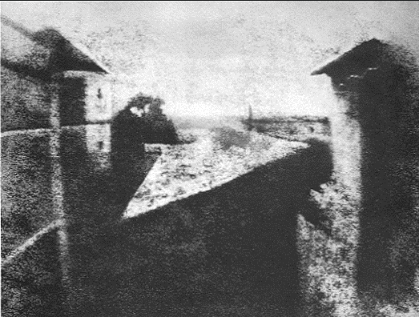
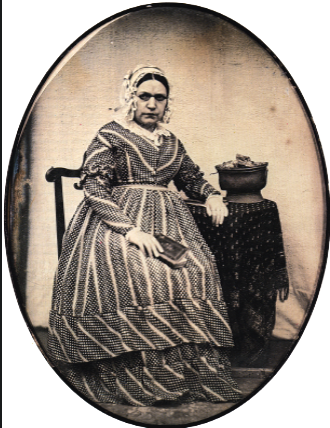
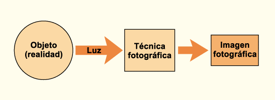
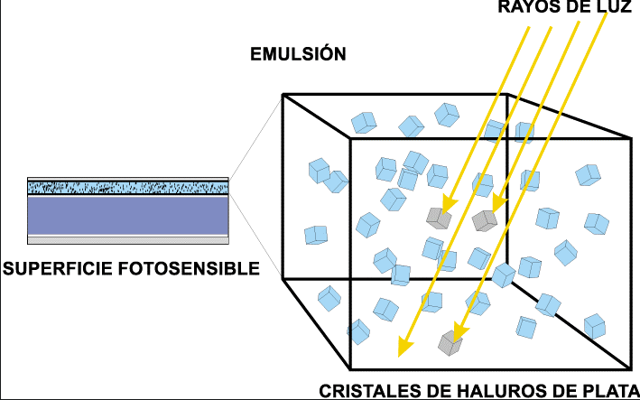

# Tema 1: Génesis de la imagen tecnográfica.

### Intro chapa:

Podemos considerar a la fotografía como el primer medio tecnográfico en el que la imagen surge a través de un proceso automático. La intermediación de una máquina (la cámara) ha supuesto que se cuestione sus principios creativos (artísticos) desde sus inicios, a diferencia de los medios tradicionales, en los que la acción manual (la quirografía) es el sistema configurador de la imagen. Pero la imagen tecnográfica tiene sus antecedentes en la remota antigüedad: la cámara oscura fue un instrumento muy conocido y perfeccionado, al igual que ciertas sustancias que reaccionaban de manera especial a la luz. La fotografía nace cuando los conocimientos de ambos campos confluyen. Este medio, con sus posibilidades y limitaciones, supondrá una revolución en las formas de producción de imágenes que tendrá enormes repercusiones en todos los ámbitos de la sociedad.

La búsqueda de un sistema que fuera capaz de construir imágenes de manera automática ha sido una constante a lo largo de la historia. La fotografía fue la primera en cumplir ese ideal. En los medios tradicionales o formas quirográficas la imagen surge como consecuencia de la **expresión manual** de un individuo que utilizaban algún útil como el lápiz, el pincel, las herramientas de tallar,etc. En cambio, en las formas tecnográficas la imagen se produce a través de un **proceso automático** a partir de las posibilidades ofrecidas por una máquina. Es en este elemento en el que se delega la formalización de la imagen, aunque ciertamente es el artista el que detentará la génesis creativa mediante el conjunto de elecciones realizadas durante la producción de la imagen.

## Imagen quirográfica vs tecnográfica:

En el contexto cultural actual la producción icónica se caracteriza por presentar una gran variedad de formas. En apenas dos siglos el hombre ha sido capaz de crear, a la luz del desarrollo científico, multitud de nuevas técnicas de producción de imágenes; a las tradicionales, resultado de la acción manual sobre unas materias, se suman otras fundamentadas en principios tecnológicos. Como consecuencia, una inmensa amalgama de imágenes aparece ante nuestros ojos a un ritmo cada vez más pronunciado. Así, atendiendo a la propia génesis operativa de la imagen, podemos destacar que los productos icónicos presentan dos maneras de ser generados: unos, las formas *quirográficas,* son expresión del proceso manual (quiro=mano); otros, las formas *tecnográficas,* son realizados a través de elementos intermediarios de orden tecnológico. En el vasto panorama actual es palpable la convivencia de ambas maneras de producir la imagen, que podemos encontrar sobre soporte físico o digital.

Las **imágenes quirográficas** son la consecuencia directa de la expresión manual de un individuo que emplea algún útil, aparato e incluso máquina para establecer un intercambio o dialéctica con la materia de creación: los diferentes artefactos son simples extensiones mecánicas de la mano del creador, y le permiten modular su energía y la materia involucrada para la configuración de las formas por él imaginadas.

La **imagen tecnográfica** es manifestación directa del proceso automático de una máquina; su génesis es mecánica, no manual, y su utilización para la creación significa, por parte del artista creador, conocer las diversas posibilidades que presenta la máquina para generarla. El autor delega en la máquina la construcción del producto icónico, pero él detenta la génesis mediante el conjunto de elecciones realizadas durante la creación.

## La era pretecnográfica:

Se hace necesario, antes de centrar nuestra atención en el campo de las tecnográfías, tener en cuenta que son fruto, más que de un desarrollo espontáneo, de una intensa y larga maduración. Este proceso se demuestra en la multitud de tentativas para crear la imagen de manera automática. Encontraremos numerosas referencias de esta búsqueda en gran parte de la historia del arte y de la ciencia del mundo occidental. Los artilugios ideados perseguían, en algunos casos, la consecución de una imagen enteramente mecánica pero, ante la falta de los conocimientos suficientes, se limitarían a servir de elementos auxiliares que facilitarían la operación de dibujar; otros, en cambio, se ajustaban desde su concepción a esta labor complementaria durante la producción de las imágenes quirográficas.

> [!CAUTION]  
> Al tomar estos apuntes, tan solo anoté las figuras que me parecieron más importantes. Sin embargo, en el test de respuesta corta se preguntan todas las figuras. Anotad **todas** las figuras con capturas de pantalla o apuntandolas en alguna nota que podáis llevar al examen y tal. ¡Lo siento! 

- (470 BCE) Mo Ti: Filósofo chino. Primeras experiencias conocidas de la formación de una imagen por medio de la cámra oscura
- (322 BCE) Aristóteles: El filósofo griego describe la cámara oscura en "Problemata", primera evidencia escrita de este dispositivo.
- (1038) Alhacén: Estudio de la reflexión y la refracción de la luz y el empleo de las lentes a través cámara oscura.
- (1238) Alberto el Grande: Conocimiento del nitrato de plata.
- (1571) Georges Fabricius: Descubrimiento del Nitrato de Plata.
- (1568) Daniel Barbaro: Desarrolla el diafragma.
- (1630) Johannes Kepler: Acuña el término "cámara oscura".
- (1537) Egnatio Danti: Desarrolla el espejo cóncavo.
- (1703) Johan Christoph Sturn: Idea el sistema reflex.
- (1802) Thomas Wedgwood: Profundizó sobre la posibilidad de formar imágenes con el de nitrato de planta. Creó fotogramas de objetos colocados sobre papel tratado con nitrato de plata y exponiéndolos al sol. La imagen desaparecía por efecto acumulativo de la luz sobre el papel, que se volvía totalmente negro. De haber podio fijar la imagen se le consideraría el primer fotógrafo.
- (1819) James Watt: Utiliza una cámara oscura combinada con soluciones de plata, pero las imágenes obtenidas eran débiles que desaparecían rápidamente.
- (1819) John Hershel: Descubrió el uso del tiosulfato de sodio como fijador de las sales de plata. Posteriormente inventó la cianotipia y acuñó los términos "fotografía", "negativo", "positivo". Informó a Daguerre de que su propio descubrimiento del tiosulfato de sodio fijaría sus fotografías haciéndolas permanentes.

## Nacimiento de la  fotografía

En el momento (en torno a 1822) en que Nicéforo Niepce (1765-1833) consigue fijar la imagen óptica de una cámara oscura sobre un soporte bidimensional, comienza una nueva etapa en las formas de producción de imágenes. Este descubrimiento lo hará motivado por su falta de habilidad con el lápiz para dibujar sus litografías a las que era aficionado.

Como ya se ha dicho, el nacimiento de la fotografía significa el comienzo de una nueva etapa en la creación de la imagen. La fotografía se fundamenta en los principios tecnológicos óptico-químicos/electrónico-digitales, pues la imagen, en su génesis, ha sufrido un proceso por el cual un compuesto fotosensible es selectivamente ennegrecido/escitado en proporción a la luz que recibe.

En 1826 Nicéphore Niepce con una exposición de 8 horas obtiene una fotografía desde una ventana. Es la primera fotografía que se conserva.

Nicephore se asociará con Louis-Jacques-Mandé **Daguerre**, artísta pintor y decorador. Años más tarde, después de la muerte de Nicephore, sus investigaciones desembocarán en la técnica del Daguerrotipo, que reducía drásticamente la exposición y mejoraba la nitidez de la imagen. Casi al mismo tiempo se desarrollarán otrás técnicas fotográficas por parte de distintos autores.

---

## Naturaleza de la fotografía

La fotografía como cualquier forma de obtención de imágenes presenta unas cualidades que las distingue de otras y que configuran su propia naturaleza. Las carácterísticas más destacadas son:

- La imagen surge a partir de un proceso automático
- Autenticidad
- Precisión de líneas y exactitud en la forma
- Otra forma convencional de representar la realidad
- Velocidad y facilidad de registro

### La imagen surge a partir de un proceso automático

Este es un rasgo particular que le diferencia de los procesos tradicionales, como la pintura, en la que un individuo por medio de una retroalimentación constante entre la mano, el ojo y el cerebro va construyendo, en un proceso secuencial, la obra. La creación de una fotografía no requiere de una habilidad manual especial, ya que la construcción de la imagen recae en la cámara (técnica fotográfica) y el fotógrafo sólo debe encontrar la escena adecuada y tener en cuenta los parámetros técnicos para proceder a realizar la fotografía. Este proceso mecánico y automático obliga a establecer una relación especial con la realidad, ya que la necesita para hacer una representación de ella. La luz que reflejan los objetos de una escena supone el elemento desencadenante de la reacción fotoquímica/electrónica digital productora de la imagen. Esto plantea el problema de la realidad fotografiable, es decir, del **referente fotográfico**, definido por Barthes como "la cosa necesariamente real que ha sido colocada ante el objetivo y sin la cual no habría fotografía", idea que debemos completar añadiendo que, además de real, tiene que ser **fotoactiva** para la película o el sensor utilizado por la cámara, es decir, su grado de opacidad así como las radiaciones electromagnéticas que entran en juego deberán ser capaces de hacer un marcaje en la emulsión o el sensor fotográfico (un objeto transparente apenas podrá verse en una fotografía, un objeto iluminado con luz ultravioleta al fotografíarlo con una cámara normal no dejará registro en la foto).

Si observamos las capas que configuran una película analógica en blanco y negro estándar la parte de la emulsión contiene una serie de cristales haluros de plata que en el momento de sacar la fotografía reciben luz, eso provoca una serie de cambios químicos (se convierten en plata negra) conformando lo que se llama **imagen latente**. Durante el **revelado** esos cambios son amplificados hasta formar una **imagen visible**. Durante el **fijado** se elimina la planta blanca que no ha recibido luz. Al final del procesado se obtiene un **negativo** que es necesario **positivar** para obtener la fotografía final.

> [!WARNING]  
> La siguiente sección de los apuntes está seguida de un mini-cuestionario. 

Derivado del proceso de creación, en el que una máquina crea la imagen de manera automática, se tiende a pensar que la fotografía es una reproducción no mediatizada capaz de facilitar el registro directo de las cosas; que la imagen que obtenemos en una fotografía es una respuesta exacta a una realidad dada. Es por eso que nos piden una fotografía para cualquier carnet oficial, un dibujo no es admitido.

La consecuencia de esto es la **autenticidad** que emana toda imagen fotográfica estándar, fruto del proceso automático seguido, que le aleja de toda distorsión producida por la mano del artista. Este suele ser el rasgo que más se destaca de la fotografía, la presunta objetividad de la formación de la imagen, le da una fuerza de convicción desconocida en cualquier otra forma de comunicación visual. A esto ayuda su capacidad de ofrecer una **precisión de líneas y una exactitud en la forma** difícilmente superada por los procesos manuales. Este argumento es el que sustenta la utilización como **herramienta documental**, su función de memoria individual y colectiva. Ahora bien, debemos tener en cuenta que si bien la fotografía es capaz de ofrecer un grado de ilusión representativa superior a cualquier método manual, no deja ser un **medio convencional de representar la realidad**, que conlleva unos factores de distorsión frente a la propia realidad. Estos factores o convenciones podemos enumerarlos de la siguiente manera:

 - Se suprime cualquier información no susceptible de convertirse en términos **ópticos** eliminándose por tanto el resto de los estímulos sensoriales (sonoros, táctiles, gustativos u olfativos).

 - El mundo tridimensional se reduce a una **representación bidimensional**, de modo que la fotografía es el resultado de la captación, a través de un sistema monofocal a modo de ojo único, de las informaciones lumínicas conformadoras de la imagen. De esta forma, se relaciona con las convenciones de la perspectiva, a través de las cuales será posible ofrecer una ilusión óptica de profundidad y de relieve.
 - **El movimiento queda abolido** y su carácter estático hace que el fotógrafo, desde un punto de vista concreto, tenga que seleccionar e inmovilizar un instante en el constante devenir de acontecimientos.
 - En la fotografía en blanco y negro, se eliminan o **alteran los valores cromáticos** del mundo mediante la traducción a grises del color y, en la fotografía en color, debido tanto a las distorsiones cromáticas inherentes a los propios sistemas de color, como a las variaciones introducidas involuntariamente durante las fases de creación de la imagen (las aberraciones de las lentes, el procesado, la conservación del material sensible, etc.)
 - El **encuadre** significa una delimitación transversal del espacio, pues es el resultado de la elección de una porción de éste para ser mostrado; esto conlleva la eliminación definitiva, en la representación, de todo lo que queda más allá de los límites del encuadre.
 - Estructuralmente, la imagen fotográfica es un **conjunto de agregados de plata o píxeles** distribuidos sobre una superficie. Esta estructura discontinua y granular tiene que vincularse con el poder de resolución del ojo humano, de modo que, la presencia de grano o el pixel en la imagen tiende a inclinar a ésta del lado de la representación, mientras que su disminución refuerza su ilusionismo realista.
 - La fotografía cuenta con cierta **relatividad en la escala de representación** del mundo. Uno objeto, ya sea grande o de dimensiones diminutas, puede tener en la representación fotográfica cualquier tamaño.

> [!NOTE]  
> Este es un ejemplo de las imágenes que pueden ser usadas como preguntas durante el cuestionario al final de la lección.

## Definición de la fotografía

La raíz de la palabra fotografía viene del griego **PHOS** que significa luz y **GRAFIA** que tiene un sentido de trazos. Es decir, etimológicamente, fotografía tiene un significado de grafía hecha con luz; es un sistema de producción de imágenes por medio de la luz.

Desde el nacimiento de la fotografía se han planteado diversas definiciones que podemos clasificar atendiendo a la manera de comprender el fenómeno fotográfico. Por un lado, tenemos **definiciones restringidas**, como la que nos propone Román Gubern *fijación fotoquímica (digital), mediante un mosaico irregular de granos de plata (o de píxeles/puntos) sobre una superficie soporte, de signos icónicos estáticos que reproducen en escala, perspectiva y gama cromática variables las apariencias ópticas contenidas en espacios encuadrados por el objetivo, durante el tiempo que dura la apertura del obturador*, este tipo de definiciones de la fotografía se refieren a una modalidad esencialmente mimética -imitativa o analógica- de ahí sus funciones reproductivas o documentales, de memoria individual o colectiva. Por otro lado tenemos, aquellas definiciones que podemos considerar **amplias**, pues no limitan a la fotografía a esta función mimética sino que las relaciona más con la actividad creativa o experimental, que nos remiten a un conjunto de experiencias de muchos creadores del campo de la fotografía que se caracterizan por alejarse del principio de fidelidad óptica propio del uso más estándar. El empleo de trucajes, la utilización de procedimientos fuera de la ortodoxia impuesta por la industria fotográfica, la invención de técnicas o, en su caso, el redescubrimiento de algunas ya olvidadas, hacen del campo de la fotografía un ámbito de creación más amplio de lo que normalmente es reconocida. Estas consideraciones nos acercan a la fotografía creativa, concebida en muchas ocasiones fuera de sus posibilidades analógicas, lo cual nos obliga -ante la inoperancia en este campo de las definiciones restringidas- a plantear definiciones capaces de abarcar toda actividad creativa, de esta manera la planteamos como *cualquier alteración de la superficie fotosensible*.
