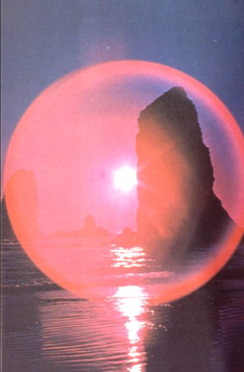

# TEMA 2. DELIMITACIÓN DEL HECHO FOTOGRÁFICO

La fotografía es un medio con unas especificidades que a través de la acción y la actitud de un individuo (el fotógrafo) es capaz de establecer un proceso comunicativo con ciertas cualidades (informativas, reproductivas, creativas), a través de la utilización de los recursos de un lenguaje específico.

## Límites tecnológicos

Cuando nos planteamos delimitar los fundamentos tecnológicos que sustentan a la fotografía se presentan una serie de dificultades que impiden establecer sus límites de una manera exacta. Ello es debido fundamentalmente a tres razones:

- Por la falta de una acotación precisa de las radiaciones capaces de crear una imagen
- Por la falta de rigor a la hora de establecer el soporte utilizado para asignarle el calificativo e fotográfico
- Por la crisis a que es sometido el principio de referencia a la realidad

### Por la falta de una acotación precisa de las radiaciones capaces de crear una imagen

La fotografía es un procedimiento de registrar la situación lumínica de una escena y crear con ello una imagen. Pero la luz es una energía electromagnética con unos valores de longitud y frecuencia determinados que los diferencian de otras energías electromagnéticas. Estas energías junto con la luz blanca forman el amplio espectro electromagnético que se presenta como un todo continuo, es decir, no existe ningún fenómeno marcado que indique las distintas fronteras entre cada tipo de radiación, sino que será el hombre en su afán clasificador el que las acote en base a unos parámetros de longitud y frecuencia. Bajo esta perspectiva vemos el débil argumento que define a la fotografía, máxime cuando la luz está compuesta por radiaciones que no son visibles (las infrarrojas y las ultravioletas) pero que podemos captar con emulsiones especiales. )

¿Deberíamos delimitar a la fotografía a la parte del espectro que el ojo humano es capaz de registrar, o por el contrario, la fotografía ha de extenderse a lo largo del espectro utilizando cualquier radiación para crear imágenes? La fotografía infrarroja, la termografía, la radiografía, etc. forman parte de un variado conjunto de técnicas capaces de ofrecer imágenes de un determinado aspecto de la realidad de una escena.

### Por la falta de rigor a la hora de establecer el soporte utilizado para signarle el calificativo fotográfico

Hemos definido a la fotografía por ser un registro de la luz en un soporte fotosensible de base química o digital. Sin embargo, con frecuencia la fotografía no se difunde en su estado original (en papel fotográfico) sino que ha sido traducida a otro medio y transportada a otro soporte, como por ejemplo en las ilustraciones fotográficas de los libros, serigrafías, fograbados, etc. cuya base no es fotoquímica sino física, pues  están constituidas por un conjunto de manchas de tinta dispuestas sobre un papel. De la misma manera hablamos de fotografías cuando tratamos con imágenes en el ordenador o en la pantalla de televisión. El avance tecnológico ha permitido registrar los rayos de luz sin la intervención del componente químico, en las cámaras fotográficas electrónicas la película es sustituida por un sensor de imagen fotosensible que hace las mismas funciones. ¿Debemos limitar el calificativo de fotografía a aquellas imágenes que se presentan sobre un soporte químico o impreso con el papel fotográfico, o por el contrario debemos extender este calificativo a todas aquellas imágenes que poseen ciertos signos que asimilamos con la fotografía pero que son mostradas por otros medios técnicos?

###  Por la crisis a que es sometido el principio de referencia a la realidad

El principio de referencia a la realidad se trastoca en el momento en que un medio puede obtener imágenes "fotográficas", es decir, con los signos propios de una fotografía, sin tener que recurrir a la realidad óptica para producirla. La imagen sintética que nos ofrece síntesis de imagen ordenador en cuanto que es capaz de generar imágenes con iguales características que las que podamos obtener con el proceso fotográfico tradicional nos obliga a replantear nuestro concepto de fotografía. ¿Debemos limitar a la fotografía por su obligada referencia a la realidad o por el contrario esta ya no es necesaria para adquirir tal calificativo?

## La fotografía como proceso de comunicación

- Su finalidad es la comunicación
(es universal debido a su gran facilidad de comprensión)

- Es el medio de expresión del fotógrafo
(A través de ella informa, educa, entretiene o comparte alguna experiencia)

- Surge fruto de una acción material y de una actitud
(Toda obra resultante de una acción material está determinada por la actitud del individuo, y será esa actitud la que caracterizará la obra realizada)

- Posee un amplio campo de aplicación
(Periodismo, publicidad, investigación, documentación, entretenimiento, la autoexpresión)

### Introducción a la lectura de una fotografía

Si observamos una fotografía cualquiera nos damos cuenta de la existencia de una serie de elementos:

a. **Una imagen**, sustancia visual, representando algo que nos es más o menos conocido o extraño, fácil o difícil de entender, etc.
b. **Un soporte físico**, generalmente un plano bidimensional, que es inseparable de la imagen y sin el cual ésta no existiría (el propio papel fotográfico en que está la imagen impresionada).
c. **Un fragmento de la realidad**, es decir, la imagen modelo que identificamos en la fotografía más o menos reconocible (un paisaje, una figura, un objeto).
En este conjunto de elementos reconocemos la mediación de tres elementos más:
d. **Un fotógrafo**, o individuo que ha obtenido la fotografía que observamos, constituido como emisor de una intencionalidad comunicativa.
e. **Una tecnología**, utillaje, instrumentos materiales y normas o procedimientos de uso, que deben ser manipulados por el fotógrafo.
f. **Un destinatario**, ya sea nosotros en tanto espectadores, u otros individuos o grupos sociales que puedan ser receptores del mensaje fotográfico.

### Actitudes frente a la fotografía

> [!WARNING]  
> En el cuestionario se pide identificar los diferentes tipos de intención de ciertas fotografías. Estudia esta sección.

Es importante señalar que una fotografía, como toda obra humana, surge fruto de una acción material y de una actitud o disposición de ánimo en la forma de emprender la acción. Podemos decir que toda obra resultante de una acción material está determinada por la actitud del individuo, y que será esa actitud la que caracterizará la cualidad de la obra realizada.

Podemos detectar la influencia que ha predominado en la actitud asumida por el fotógrafo observando una fotografía. En general podemos establecer cuatro actitudes a la hora de guiar al fotógrafo:

#### Actitud imitativa

**Una actitud imitativa**, en donde el fotógrafo trata de repetir lo que otros fotógrafos ya han hecho antes que él. Las grandes obras suelen ser las influyentes en la actitud mimética. Esta actitud por lo general conduce a la superficialidad y a la redundancia, aunque supone la mejor forma de iniciarse y aprender el estilo de los grandes fotógrafos

#### Actitud reproductiva

**Una actitud reproductiva**, en donde el fotógrafo registra fielmente el modelo el cual se constituye en el centro del mensaje. Ya sea el modelo un personaje famoso, un incidente ocurrido, una obra de arte, un fenómeno de la naturaleza o un momento histórico, la actitud reproductiva refleja un sentido eminentemente documentalista, y por tanto, la fotografía está determinada por hechos y situaciones de la realidad exterior considerados como dignos de ser perpetuados en una imagen. Este tipo de actitud muestra por lo común un gusto por el detalle, la literalidad y se orienta hacia la identidad de lo fotografiado.

#### Actitud creativa

**Una actitud creativa**, en la que el fotógrafo tiene una disposición por innovar, opuesta a imitación y reproductividad. La actitud creativa introduce en el mundo formas nuevas, es decir, mensajes originales.

#### Actitud experimental

**Una actitud experimental**, como forma particular de creatividad, la cual no siempre es de carácter intuitivo. La actitud experimental implica un gusto por la búsqueda y un sentido de la combinatoria, de ahí, que este tan estrechamente relacionada con la propia técnica.

## El lenguaje fotográfico

> [!WARNING]  
> En el cuestionario se pide identificar los diferentes tipos signos del lenguaje de ciertas fotografías. Estudia esta sección.

Un **signo** puede definirse como aquello que al ser percibido conduce al conocimiento de otra cosa, es decir, es una unidad de sentido. Cuando los signos se organizan en un sistema en el que pueden combinarse para transmitir significados estamos hablando de un **lenguaje**. En el caso de la fotografía encontraremos dos tipos de signos: los signos **analógicos** o literales derivados del registro de la realidad y los signos **no analógicos** o abstractos atribuidos a los fenómenos técnicos del medio fotográfico.

Estos últimos son los que denominamos **signos fotográficos**. Los podemos definir como aquellos elementos de imagen no percibibles en la visión directa de la realidad pero si observables en una imagen fotográfica. Estos han sido incorporados por la técnica fotográfica, a través de los procedimientos empleados por el fotógrafo. Estos elementos se comportan como signos propios porque sólo los encontraremos en aquellas imágenes resultantes del proceso fotográfico.

Los signos fotográficos los podemos dividir en cuatro grandes grupos:

**Los signos ópticos**. Como el flou, el desenfoque, la profundidad de campo.

**Los signos lumínicos**. Las estrellas y otras formas geométricas producidas por la incidencia de la luz en el objetivo.

**Los signos cinéticos.** Las estelas luminosas, los barridos, la descomposición del movimiento, etc.

**Los signos químicos/electrónicos.** Las solarizaciones, el grano/ruido, los quimigramas, pixelizado, etc.

### Ópticos

**Profundidad de campo** es la zona que aparece nítida en la imagen debido al **enfoque selectivo** que realizó el fotógrafo sobre las manos.

Efecto **Flou** producido al incorporar un filtro especial o una tela fina que produce una dispersión de la luz creando fotografía con aspecto desvaído o borroso

### Lumínicos

En determinadas condiciones al incidir la luz directamente en la lente pueden aparecer formas diversas en la fotografía.

### Cinéticos

Descomposición del movimiento producido por el cambio de la distancia focal del **zoom** durante la exposición de la fotografía

Las estelas se producen al mover la cámara en un ambiente con poca luz y con fuentes de luz puntual

### Químicos/digitales

Técnica de la solarización que produce una franja negra alrededor de la figura, Se produce por una breve exposición del negativo durante el revelado.

