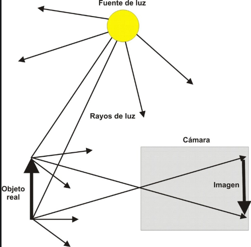
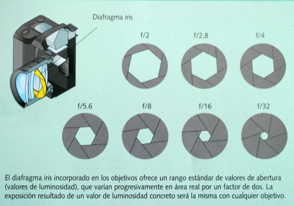

# Tema 3: La formación de la imagen fotográfica

Para entender cómo se forma la imagen en una cámara fotográfica hay que tener en cuenta los factores y elementos de control que intervienen. En primer lugar, veremos el principio de la formación de imagen óptica en la cámara y el papel de la lente para obtener una imagen óptima. En segundo lugar, trataremos los factores que intervienen durante la exposición en la cámara fotográfica para obtener una imagen correcta.

# Fundamentos de la cámara

La **imagen óptica** (imagen realizada a partir de la luz) se obtiene cuando los rayos de luz entran en el interior de un recinto oscuro a través de un pequeño orificio (principio de la cámara oscura conocido desde la antigüedad).

Para entender cómo se forma recurrimos a la **óptica geométrica** que lo explica entendiendo que la luz viaja en línea recta y puede representarse con líneas (en realidad la luz tiene una naturaleza ondulatoria y corpuscular).

El **principio de la cámara oscura** dice así: Una **fuente de luz** (como el sol) emite rayos de luz en todas las direcciones, un conjunto de rayos inciden sobre el objeto real iluminándolo. La superficie del objeto real **absorbe** cierta cantidad de luz y **refleja** otra en múltiples direcciones (dependiendo de la naturaleza de la composición del objeto). Una parte de de esa luz reflejada llegará a la cámara y entrará por el orificio al interior de la cámara. Los rayos iluminarán la pared opuesta al orificio creando una imagen que se corresponderá con los puntos de luz de los rayos que provienen del objeto real. A un punto de la imagen óptica se corresponde uno del objeto real. Como la luz viaja en línea recta la imagen resultante está invertida lateral y verticalmente en el interior de la cámara.

## La lente

Las primitivas cámaras oscuras no tenían lente, tecnicamente no es necesario ningún objetivo para hacer fotografías (la **fotografía estenopeica** utiliza cajas sin objetivos, solo un pequeño orificio -el estenopo-). La incorporación de una lente mejora mucho la **nitidez** de la imagen obtenida, al tiempo que se crean efectos que no son posibles sin la lente (**campo de profundidad**).

Una lente **simple biconvexa** (lente viene de la palabra lenteja, porque recuerda su forma) desde un punto de vista de la óptica se compone de los siguientes elementos.

La lente funciona bajo el principio de la **refracción** (la luz sufre una desviación al pasar de un medio a otro, del aire al vidrio del que está hecho la lente)

Cuando los rayos de luz atraviesan la lente (un **objetivo** está compuesto de varias lentes pero se comporta como una lente simple) la luz se desvía hacia un punto denominado **punto focal** o **foco**. Cuando **enfocamos** lo que hacemos es mover la lente hacia delante o hacia detrás para conseguir que el foco coincida con el **plano focal** (donde está la película o el sensor). Se toma como referencia la distancia que hay entre el **centro óptico de la lente** y el plano focal cuando se enfoca al infinito (los rayos llegan paralelos). A esa distancia se la denomina **distancia focal** y permite clasificar los objetivos (objetivos distancia focal corta -angulares- objetivos de focal larga -teleobjetivos-).

## El ojo, la cámara analógica y la cámara digital

El funcionamiento de la cámara (analógica o digital) no deja de ser un copia de cómo funciona el ojo. Todos estos sistemas cuentan con los mismos elementos: una lente/cristalino, un diafragma/iris, un elemento fotosensible película o sensor/retina. La imagen resultante se procesa en el laboratorio (fotografía analógica) o con un programa de edición (fotografía digital) o en el cerebro en el caso de la imagen retiniana.

## Cámara Reflex vs Compacta

Hay muchos tipos de cámaras. Las más habituales son: las **cámaras compactas** enfocadas a un uso doméstico (que van siendo sustituidas por los móviles), las **cámaras réflex** enfocadas para un uso por parte de aficionados o profesionales y las **cámaras de dispositivos móviles** enfocadas a un uso general.

La cámara réflex se caracterizan por tener un elemento (el **pentaprisma**) encargado de enderezar la imagen desviada hacia el visor y ver la escena de manera normal.

# Factores que intervienen durante la exposición fotográfica

Obtener una fotografía bien expuesta significa que la luz que ha entrado en la cámara es la adecuada. Para obtener una exposición correcta debemos tener presente los siguientes aspectos:

## La velocidad de obturación

Es el **tiempo** que tarda la cámara durante el disparo en exponer la imagen en el sensor o la pélícula.

En el momento del disparo un dispositivo denominado **obturador** se abre para que entre luz en la cámara y así formar la imagen.

En el **obturador de cortinillas** una tela se desplaza horizontalmete para dejar pasar la luz a la película. Existen otros tipos de obturadores (central, electrónico)

Para conocer de manera exacta el tiempo que está el obturador abierto se ha creado una **escala de velocidad estandarizada**, basada en el principio de doble y mitad. La escala sería:

*B, 1, 2, 4, 8, 15, 30, 60, 125, 250, 500, 1000, 2000, 4000, 8000*

1 es un segundo de exposición. El resto son fracciones de segundo, 2 (1/2), el 4 (1/4), el 8 (1/8), así con todos. (B significa bulb, que era un dispositivo para disparar la cámara que permitía mantener abierto el obturador todo el tiempo que se mantenía apretado).

## El diafragma

El diafragma (f) es es el dispositivo que regula la entrada de luz. Lo abrimos o cerramos para que entre más o menos luz, como si fuera un grifo.

Para saber el grado de apertura se usa una escala estandarizada (El nº f)

*f/1, f/1.4, f/2, f/2.8, f/4, f/5.6, f/8, f/11, f/16, f/22, f/32 y f/64*

Esta escala está realizada en base al nº f y se basa en el principio de doble/mitad. Para entender los números hay que tener en cuenta lo siguiente:

El número refleja el número de veces que supone el **diámetro** del agujero dejado por el diafragma con respecto a la distancia focal. A un número más grande más pequeño es el orificio y menos luz deja pasar.

Muchas cámaras compactas disponen de pocos números f (diafragmas) y los dispositivos móviles por lo general solo tienen un número f. En las cámaras réflex y o las sin espejo, enfocadas para un uso profesional o para aficionados a la fotografía (con objetivos intercambiables), los diafragmas disponibles vienen dados por el objetivo que se esté usando.

## La sensibilidad 

Es la capacidad para responder a la luz. A mayor sensibilidad menor cantidad de luz es necesaria para obtener una imagen correcta. La sensibilidad esta medida en una **escala** denominada **ISO** (International Standards Organization)

La sensibilidad tiene una consecuencia directa con el ruido en la imagen, a mayor sensibilidad mayor ruido se verá.

## El balance de blancos

A diferencia de ojo los sensores responden a las fuentes de luz de distintos colores de una manera fija. Para evitar que la fotografía salga con **dominantes de color** se ha incorporado a las cámaras un dispositivo denominado **balance de blancos**. Este dispositivo mide el **color de la luz** para hacer los ajustes necesarios y así obtener una imagen natural.

El color de la luz o **temperatura del color** es una manera de describir **la luz emitida** a través de la temperatura, se expresa en grados Kelvin.

Si no tenemos en cuenta la temperatura del color de la escena y la regulamos con el balance de blancos podemos tener fotografías con dominantes de color

