# Tema 5: La exposición en la toma fotográfica

Este es uno de los temas más complejos y quizás a los que menos atención se presta. Supone terner presente las condiciones de luz de la escena (concepto de escena fotográfica), medirla (sistemas de medición del exposímetro o fotómetro) y saber interpretar la información (sistema de zonas, histograma) para realizar el registro con las mejores condiciones técnicas y estéticas.

En el momento de la realización de una fotografía de una determinada escena hay un proceso trascendental e ineludible que configura lo que se denomina "**la exposición**". Tiene un carácter eminentemente técnico y junto a otras operaciones de naturaleza creativa configura la **toma fotográfica**. El enfrentamiento a este proceso puede hacerse desde diferentes puntos de vista en función de las habilidades e intereses del sujeto que realiza la fotografía y no hay que olvidar que la materialización de ésta viene determinada por este proceso desde el primer momento. La cámara moderna ofrece desde hace tiempo numerosos controles que permiten realizar la fotografía de manera automática, semiautomática y manual, y la era digital abre muchas posibilidades en este sentido. Este objeto de aprendizaje va dirigido a dar un paso más en la práctica fotográfica, busca entender y controlar todas las variables en la toma con el fin de obtener una fotografía expuesta conforme a los intereses del fotógrafo.

**Definiciones y consideraciones:**

- La exposición es el momento en el que los mecanismos de la cámara dejan entrar luz al sensor, desencadenándose una serie de procesos que en última instancia producen una imagen fotográfica.
- En términos prácticos es la cantidad de luz que llega al sensor/película.
- La exposición depende inicialmente de la luz que refleja cada objeto de la escena.
- La exposición conlleva ciertas decisiones y requiere tener en cuenta cómo se va a medir la luz y cómo se ubican los tonos de la escena dentro de la escala tonal de la fotografía. Mediante la exposición controlamos el equilibrio tonal de la fotografía.

### Concepto de escena

La fotografía es una técnica que permite registrar imágenes del mundo que nos rodea. Esta es una afirmación muy común que nos habla sobre la esencia de la fotografía pero que es necesario precisar con el fin de entender los numerosos y complejos aspectos que entran en juego.

En primer lugar hay que definir qué cosas puede registrar una cámara fotográfica. Si tomamos en consideración una cámara estándar, dentro de las numerosas tipologías y calidades, dirigida a la obtención de imágenes dentro del rango de **luz visible**, es necesario especificar que aquello que se va a registrar fotográficamente, denominado **referente**, debe reunir una cualidad esencial: su naturaleza debe ser capaz de reflejar, emitir o transmitir luz fotoactiva. Es decir, la luz que llegue a la cámara debe ser capaz de excitar los elementos del sensor para iniciar el proceso de registro, de manera que la ausencia de luz o aquella que no esté dentro del rango de sensibilidades del sensor de la cámara no producirá ninguna huella visual.

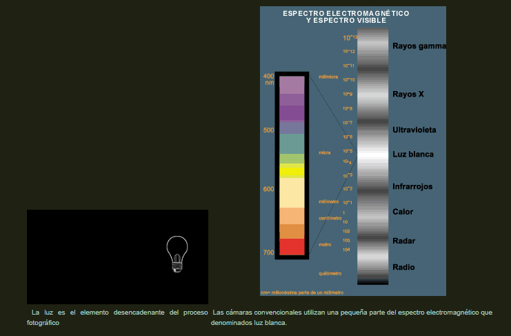

Desde un punto de vista fotográfico podemos acordar que una escena, más allá de los elementos presentes reconocibles o no, como **el conjunto de rayos de luz reflejados, absorbidos, transmitidos o emitidos, dentro de un contexto espacial dado, que llegan a la cámara creando en última instancia una imagen cuando son capaces de excitar los elementos fotosensibles**.

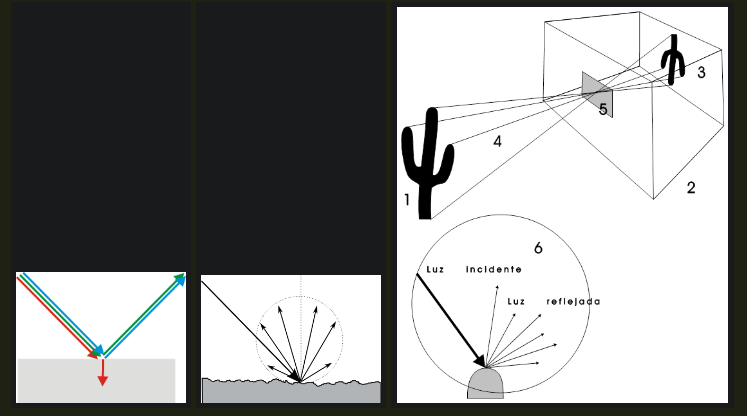

| Aunque los fenómenos de interacción entre la luz y la materia son amplios y complejos en la práctica podemos convenir que una escena fotografíca está compuesta en su totalidad por rayos de luz reflejados de manera difusa. Estos rayos de luz son resultado de los diferentes coeficientes de reflexión y de absorción de los objetos, es decir de la capacidad para absorver y reflejar cierta cantidad de energía luminosa. Las cualidades moleculares y la naturaleza de la superficie son determinantes en estos fenómenos conformadores de la información visual (color y brillo) que percibimos y registramos fotográficamente. | Esquemáticamente la formación de la imagen en una cámara sería de la siguiente manera: la luz incide sobre la superficie de un objeto real (1), esta luz en parte es absorbida y en parte reflejada, en función de la cualidades físicas de la superficie del objeto (6), cierta cantidad de rayos reflejados (4) llegan al elemento colector (5) (objetivo) de la cámara (2) formando una imagen óptica sobre la superficie del material fotosensible. Después de los procesos electrónicos/químicos se objetiene una imagen fotográfica. |
| ------------------------------------------------------------ | ------------------------------------------------------------ |

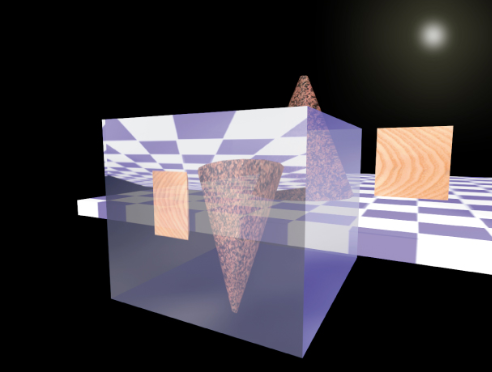

Visión idealizada de la formación de la imágen óptica en el interior de la cámara durante la exposición.

### Escena y percepción: Iluminancia, reflectancia, luminancia y luminosidad.

Desde un punto de vista de la percepción una escena es un **estímulo distal**. A diferencia de la pintura, en el que el artista pinta una representación de lo que percibe visualmente (**luminosidad**), la cámara registra la imagen resultante de la cantidad de luz que reflejan los objetos. A esta cantidad de luz se la denomina **luminancia** y es el estímulo al que atienden la cámara y también el ojo. Desde un punto de vista perceptivo no existe ningún modo directo de discriminar entre la capacidad reflexión/absorción de los objetos (**reflectancia**) y la luz que los ilumina (**iluminancia**), pues el ojo o la cámara reciben exclusivamente la intensidad de luz resultante (**luminancia**). De manera que a estos nos les llega ninguna información acerca de la proporción en que los dos componentes contribuyen a ese resultado.

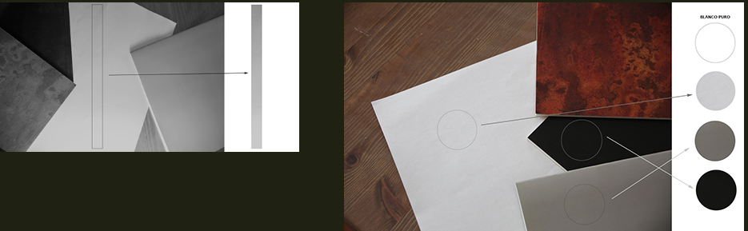

| Para el sistema perceptivo todos los puntos que posean el mismo valor de luz reflejada se percibirán como un conjunto, mientras que aquellas zonas que varien son entendidas como algo separado, surgiendo el contorno y la separación figura/fondo. Desde el punto de vista de un observador la superficie de un objeto puede ofrecer una gama de tonos de grises (un gradiente) en función de su forma y la dirección de la luz que lo ilumina, que es aprovechado por el cerebro para percibir la profunidad. | En una escena, con un mayor o menor número de valores tonales, siempre tiene dos valores que señalan los extremos de la escala. La relación que podemos establecer entre el nivel de luz reflejada por estos dos elementos nos define el contaste de la escena. Partimos de la base de que el blanco absoluto no existe (ninguna superficie es capaz de reflejar el 100% de la luz ya que absorbe siempre algo de luz). Mediante la asignación de valores relativos podemos establecer el nivel de contraste de una escena, de manera que si le asignamos la unidad a la zona más oscura la expresamos con **x:1**, señalando que el punto más brillante es x veces más luminoso que el oscuro. Una escena con poco contraste como un paisaje con niebla puede tener un 2:1, mientras que un amancer puede alcanzar más de un 1000:1. |
| ------------------------------------------------------------ | ------------------------------------------------------------ |

Para entender en toda su dimensión el problema de la exposición en la toma fotográfica es necesario comprender los conceptos básicos en relación con la manera que el cerebro humano percibe la información visual. Partimos de la luminancia de una escena, combinación de la iluminancia, o gradiente de sombreado que modela los objetos debido efecto tridimensional que induce, y la reflectancia que nos informa sobre las cualidades del objeto en virtud a las características de la superficie donde es modulada la luz que se refleja. Esta información de luminancia que recoge la retina es procesada por el córtex visual, detectando los bordes mediante la separanción de la iluminancia de la reflectancia y recombinándola de una manera muy especial para construir visualmente el mundo tal y como lo vemos. A la diferencia entre la luminancia y su percepción se la denomina luminosidad (brillo). Esta es la causa de la discrepancia (y fuente de decepción) entre la imagen de la toma fotográfica y lo que percibimos visualmente.

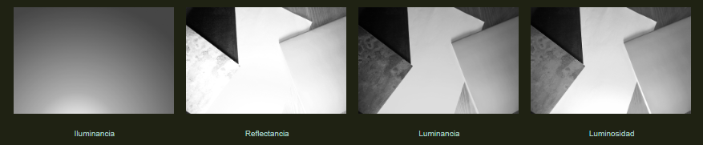

## Fundamentos: la exposición básica

Una exposición correcta debe tener presente los siguientes factores: **la velocidad de obturación**, **el diafragma** y **la sensibilidad**.

**La velocidad de obturación.**

La velocidad de obturación es el tiempo que tarda la cámara, durante el disparo, en exponer la imagen en el sensor. En el momento del disparo un dispositivo denominado obturador se abre para que entre luz en la cámara y así formar la imagen.

 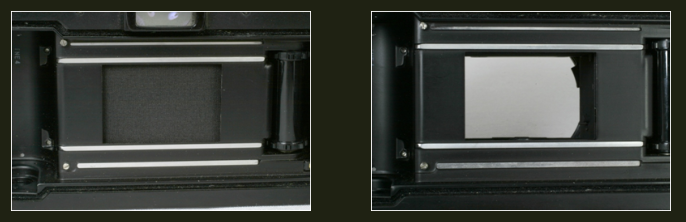

El obturador impide la entrada de luz al elemento fotosensible (en la imagen el de una cámara analógica) para ello se interponen unas cortinillas o laminillas, (según diseño), para que al apretar el botón de disparo se abran un tiempo prefijado y lo expongan a la luz. En las cámara compactas digitales el obturador suele ser de tipo electrónico que ciega al sensor durante el tiempo de exposición. 

Para conocer de manera exacta el tiempo que está el obturador abierto se ha creado una escala de velocidad estandarizada, basada en el principio de doble y mitad (logarítmica). Cada valor numérico duplica el tiempo al que antecede y lo divide al que sigue. Donde 1 indica un segundo y los siguientes son fracciones de segundo, por tanto el 2 es medio segundo, 4 un cuarto de segundo y asi sucesivamente hasta llegar a fracciones de tiempo extremadamente rápidas. Hay que señalar que muchas cámaras al 2 (1/2 segundo) lo expresan con decimales (0,5 segundo). Así mismo, entre estos números estándares se le añaden pasos intermedios.

**1, 2, 4, 8, 15, 30, 60, 125, 250, 500, 1000, 2000, 4000, 8000**

**El diafragma**

El diafragma es el dispositivo que regula la entrada de luz. Lo abrimos o cerramos para que entre más o menos luz. Para saber el grado de apertura se utiliza una escala estandarizada basada en el **número f**, que también tiene un fundamento logarítmico, a razón del principio de doble/mitad.

**f/1, f/1.4, f/2, f/2.8, f/4, f/5.6, f/8, f/11, f/16, f/22, f/32 y f/64**

El **nº f** nos indica la luminosidad, es decir el diámetro del agujero por donde entra la luz. Este número surge de la división de la distancia focal (distancia entre el plano focal donde se sitúa el senso y el centro óptico teórico de la lente) por el diámetro de la abertura.

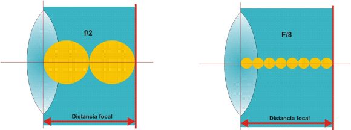

**Relación diafragma/obturador.**

Para obtener una fotografía bien expuesta es necesario que entre la cantidad de luz adecuada. Una significativa cantidad mayor o menor de luz tendrá consecuencias negativas sobre la imagen. La exposición básica se regula estableciendo una relación entre el diafragma y el oburador. Si con una relación velocidad de 60 / f. 4 dejamos entrar a la cámara x cantidad de luz, con una de 60 / f. 2,8 entraría el doble, de igual manera que con con una de 30 / f. 4, sin embargo con una de 500 / f. 1,4 entraría la misma cantidad.

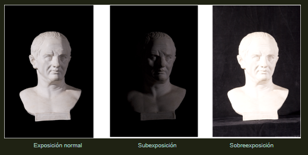

**La sensibilidad.**

Es la capacidad para responder a la luz. A mayor sensibilidad menor cantidad de luz es necesaria para obtener una imagen correcta. La sensibilidad está medida en una escala denominada ISO (*Inernational Standards Organization*) y también se rige por una base logarítmica bajo el principio de doble y mitad. Una sensibilidad muy elevada nos permite obtener fotografías con muy poca luz, pero en contrapartida aparacerá un elemento indeseado el ruido (algo similar al antiguo grano de las películas).

**El fotómetro.**

Estos tres factores se combinan a partir de una información esencial: la cantidad de luz presente en la escena. Para ello las cámaras están dotadas de un dispositivo denominado **fotómetro** o más propiamente dicho **exposímetro**. Mediante este instrumento la cámara puede determinar objtivamente la cantidad de luz que la escena refleja. Pero una escena, como vimos anteriormente, habitualmente es una compleja maraña de haces de luz que han sido modulados por la superficie de la materia presente. Esto hace algo más complejo la toma de decisiones a la hora de regular los mecanismos de control de la exposición.

El fotómetro en su diseño ha sido calibrado para una escena tipo que se corresponde con las escenas que estadísticamente se fotografían habitualmente (en torno al 80%), se ha estipulado que esta escena tipo refleja un 18 % de luz, que se plasma en un gris medio. Toda escena en la que el promedio de luz reflejada (ya que refleja más cantidad, como en el caso de un paisaje nevado, o menos, como un actor vestido de negro delante de un telón oscuro) se desvíe de este gris medio producirá errores en la lectura del fotómetro.

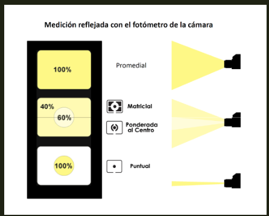

| **Promedial**. Es el tipo de medición más básico propio de cámaras básicas o antiguas. Al medir toda la escena por igual induce al error si no se toman medidas correctoras. En la escena de un paisaje la luz que proviene del cielo es mucho mayor que la reflejada por las montañas, árboles o casas, de manera el resultado será una subexposición de éstas al salir perjudicadas en la balanza de la exposición calculada en base al promedio realizado junto con el cielo. |
| ------------------------------------------------------------ |
| **Ponderado.** Para superar los problemas del sistema promedial se ideó éste con la idea de que los objetos más importantes generalmente se sitúan en el centro del encuadre midiéndose, en consecuencia, una mayor porporción de luz en esta zona. Los sistemas más modernos denominados **matriciales** llevan a un extremo estre principio a través de la medición de múltiples zonas evaluando sus mediciones parciales con complejos algoritmos con el fin de ofrecer una exposición lo más perfecta posible. |
| **Puntual**. La forma más precisa de medir la escena es hacerlo por zonas pequeñas, la lectura puntual conlleva aparejada a una mayor dedicación por parte del fotógrafo que deberá tomar las decisiones adecuadas para obtener la exposición deseada. |

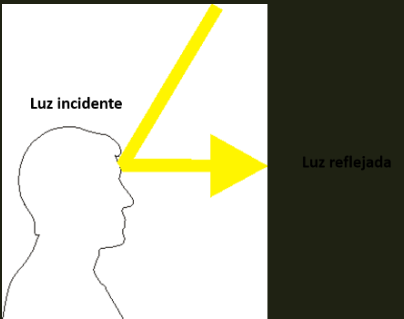

Los fotómetros incorporados a las cámaras, sea cual sea su tipo, miden la luz que es reflejada por la escena. Para medir la luz incidente es necesario utilizar un fotómetro manual, separado de la cámara. Este tipo de medición da valores más exactos a la hora de decidir la exposición.

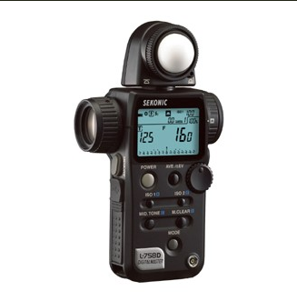

 El interfaz del fotómetro en las cámaras más avanzadas como las réflex, las compactas avanzadas o la famila de las cuatrotercios ofrece información relativa a la velocidad, diafragma, sensibilidad, otras opciones que hayamos seleccionado (balance de blancos, compensación de luces, etc.) y la información de otros distpositivos de la imagen. El método más habitual para indicar el grado de exposición es el que utiliza la escala **EV**.

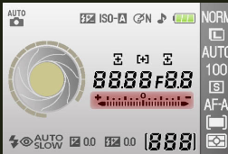

**El valor de exposición EV.**

El Valor de Exposición (EV) expresa en un solo número el resultado de los dos factores que intervienen en la exposición: la velocidad de obturación y la apertura de diafragma, indicándonos de un modo sencillo la cantidad de luz que llega al sensor durante la toma. Los valores habituales son:

**-2  -1  0  +1  +2**

 El valor 0 EV representa la exposición que la cámara entiende como correcta. A partir de ahí se representan desviaciones positivas (sobreexposición) y negativas (subexposición).

 Las decisiones a partir de la estimación ofrecida por el fotómetro se puede hacer de varias maneras, en función de las posibilidades de la cámara, las habituales son: 

- A (Modo automático), los algoritmos de la cámara son los que deciden la exposición variando los tres parámetros
- M (modo manual), el fotógrafo es el encargado de tomar todas las decisiones de la exposición variando los trés parámetros.
- Ap (modo prioridad de apertura), se prioriza un valor de diafragma fijado y automáticamente la velocidad es decidida por la cámara.
- Tv (modo prioridad de velocidad), se prioriza un valor de velocidad fijado y automáticamente la cámara busca el valor f, que considera más adecuado.
- Modos creativos (paisaje, retrato, deporte, nocturno, etc. representados mediante pictogramas) configuran los parámetros para ajustarse a las prioridadesque cada modo necesita para obtener lo que considera la mejor exposición.

> [!Note]
>
> Ejercita los contenidos vistos en esta sección mediante el siguiente simulador: [/http://www.canonoutsideofauto.ca/play/](http://www.canonoutsideofauto.ca/play/)

## Fundamentos: el registro de la escena

### Latitud de exposición

Una vez que la luz entra en la cámara esta se proyecta sobre un elemento fotosensible encargado de traducir las variaciones de luz en variaciones de tono. La película lo realiza a través de procedimientos químicos con agregados de plata metálica que reproducen proporcionalmente las variaciones de luz. En las cámaras digitrales el sensor efectua esto mediante la conversión de la de luz en variaciones proporcionales de voltaje eléctrico. Estos dispositivos emulan al ojo en donde la luz que entra, a través del iris, es proyectada en la retina que la convierte en impulsos nerviosos de naturaleza eléctrica.

Pero hay una diferencia fundamental en el funcionamiento en la respuesta a la luz de estos sistemas. El ojo y la película tienen una respuesta **no lineal** frente a la linealidad del soporte digital. Para entenderlo mejor podemos visualizarlo en el siguiente ejemplo: si encendemos una bombilla delante de una cámara y exponemos durante un tiempo x el sensor recogerá cierta cantidad de luz generando un cantidad de voltaje o carga eléctrica. Si encendemos otra bombilla de igual potencia esta carga se duplicará en el mismo período de tiempo. Se triplicará si encendemos tres bombillas y así sucesivamente. Esto quiere decir que la escala va creciendo de forma **lineal** generando una serie o progresión aritmética (1,2,3,4,5,...). El ojo y en general todos los sentidos tienen una respuesta no lineal para evitar sobrecargas que lo dañaría. En el ejemplo anterior al encender una segunda bombilla no veríamos el doble de estímulo visual o triple si encendiésemos una tercera. El cerebro se encarga de medir las diferencias logarítmicamente en una escala en la que cada valor duplica al anterior (1, 2, 4, 8, 16, 32, ...) de manera que el efecto que tiene en el ojo la luz resultante de pasar, por ejemplo, de 16 a 32 bombillas sería igual que de 1 a 2 ya que la respuesta del ojo va decayendo a medida recibe más luz.

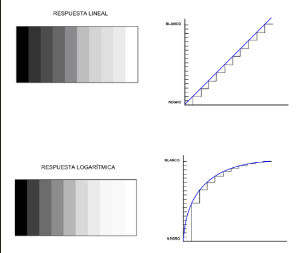

El rango o margen que tiene un determinado sensor de detectar el máximo nivel de luminosidad sin llegar a saturarse y el mínimo posible, desechando el ruido inherente al propio sistema, se denomina **latitud de exposición** (tambien denominado rando dinámico, amplitud tonal, escala tonal, intervalo tonal o margen de densidades). Fuera de este margen de sensibilidad la cámara no es capaz de ver nada, registrando un negro o un blanco absolutos. Este rango viene determinado por muchos factores en el diseño del propio dispositivo fotosensible (sensor). En términos fotográficos la latidud de exposición se mide en diafragmas (también denominados pasos o *stops*). Los diafragmas conforman una escala de tipo logarítmico en la que cada paso implica doblar la cantidad de luz del paso anterior. El ojo humano mediante rápidos ajustes de la pupila puede llegar a tener un rango de 24 diafragmas y con una abertura constante entre 10 y 14.

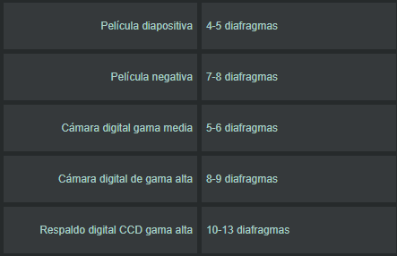

Toda esta información tonal que el dispotivo puede detectar se trata asignándole cierta cantidad de bits, el estándar son 12, aunque hay cámaras de 14 y hasta 16 bits. Un mayor rango dinámico debe estar asociado a una mayor profundidad de bits. Pero los sensores captan más información con cantidades suficiente de luz, a menos luz se van haciendo menos eficaces, por consiguiente la información tonal se acumula en las altas luces y paulatinamente va disminuyendo en los medios tonos y en las sombras que se han registrado.

## El tono y la exposición

### Creación del tono

Al hacer una fotografía debemos ser consicientes que en el momento de la exposición, con las decisiones tomadas, estamos estableciendo un determinado esquema tonal en la imagen. Este esquema comienza cuando establecemos el gris medio que corresponde con el punto donde tenemos la medición del fotómetro de la cámara (luz reflejada). Al medir con el fotómetro sobre una determinada figura de la escena (mediante una medición puntual desde el punto de la toma o acercándonos) dejaremos su tono en este punto. Al usar un diafragma más abierto, aclaramos el tono y al cerrarlo lo oscurecemos. Así es como decidimos la traducción del tono de la escena al tono de la imagen fotográfica.

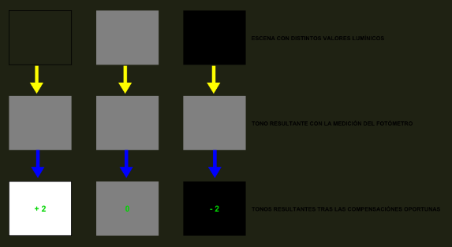

Las compensaciones no serían necesaria si midiésemos la **luz incidente** con un fotómetro manual o mediante la ayuda de una superficie que refleje exactamente el 18%, es la denominada **Carta gris de Kodak.**

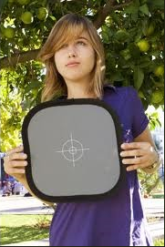

Con la luz y la exposición podemos determinar la **clave o tono de la escena**.Cuando la imagen resultante tiene una tonalidad dominante clara se dice que está en **clave alta** (high key). Cuando el efecto buscado busca lo contrario se denomina en **clave baja** (low key).

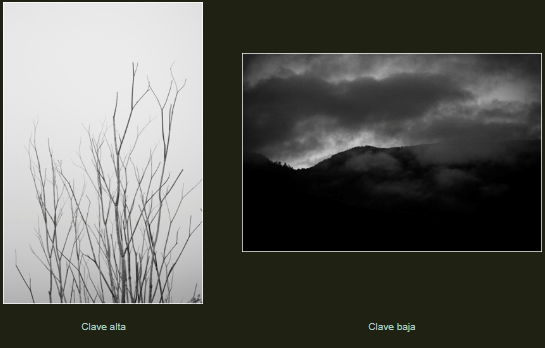

### El esquema tonal

Los tonos de una escena podemos clasificarlos en dos tipos:

1. **Tonos de acento**.

Los **negros** y los **blancos** son los tonos de acento. No pueden representar detalles, son masas opacas de tono. Representan la tinta más oscura imprimible y el blanco del papel (en el caso de la impresión digital), o la mayor y la menor densidad que te da el monitor o la película (o papel fotográfico químico).

 En los blancos siempre se sitúan los reflejos especulares (aquellos reflejos ofrecidos en función de la luz incidente por superficiés pulidas, cromadas, mojadas, nubes muy iluminadas, etc). No todas las fotografías presentan estos tonos de acento.

2. **Tonos de detalle**.

El resto de los tonos presentes en la escena configuran los tonos de detalle. Esquemáticamente pueden clasificarse en cuatro niveles o grados tonales:

1. **Sombras** (segundas sombras)
2. **Tonos medios oscuros** (primeras sombras)
3. **Tonos medios claros** (primeras luces)
4. **Luces** (segundas luces)

En relación a estos grados tonales hay tres zonas a considerar:

1. **Límite de negros** que es el punto donde perdemos los detalles de las sombras porque empiezan los negros.
2. **Gris medio** la zona que se corresponde con la medida del fotómetro.
3. **Límite de blanco** es el punto en el que dejamos de tener detalles en las luces porque empiezan los tonos blancos

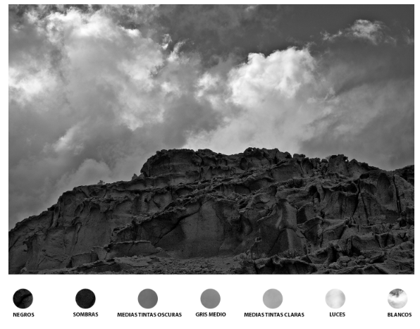

### El sistema de zonas

El sistema de zonas consiste en consiste en establecer una escala en la que se representa todos los tonos de blanco y negro, desde el blanco al negro más puros. Cada zona es dos veces más clara que la anterior, es decir equivale a un paso en el diafragma.

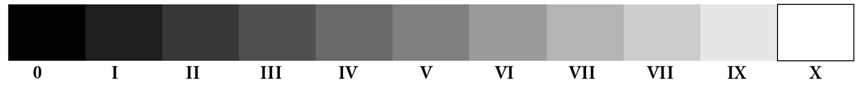

A través de esta escala podemos previsualizar los tonos resultantes en la imagen registrada y tomar decisiones en la medida en que se decide medir una determinada zona en la escena real y considerar el resultado en base a cómo afecta al resto de zonas.

La zona III es el tono más oscuro que debería dar detalles significativos.
La zona V es el gris medio de la carta gris.
La zona VI suele ser la de la piel clara.
La zona VII es el gris más claro que podría dar detalles significativos (altas luces)
La zona IX es la zona de límite de blancos (dejan de tener detalles las luces)

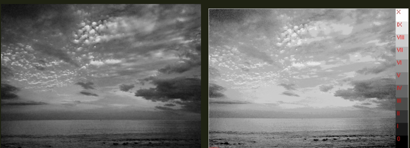

El control de la exposición mediante el sistema de zonas nos permite obtener fotografías con una gran riqueza de tonos de la escena original.

## La exposición a través del histograma

El histograma es una representación de la distribución tonal de una fotografía. Nos dice la frecuencia con que un determinado tono aparece en la imagen. En una imagen de 8 bits nos muestra los 256 tonos de gris desde el 0 (negro absoluto) al 255 (blanco absoluto). Esta información es muy valiosa y fiable facilitando la toma de decisiones durante la exposición.

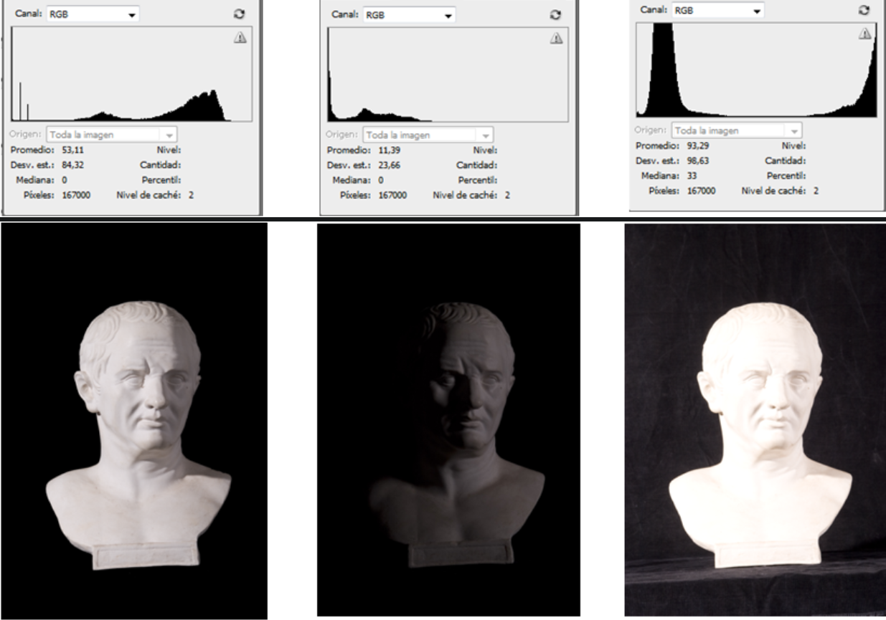

Los histogramas de las respectivas fotografías muestran la distribución tonal de la escena, caracterizada por presentar un contraste elevado entre la figura y el fondo. Una imagen bien expuesta debería mostrar un histograma completo sin zonas de recorte. El caso de la fotografía subexpuesta refleja una falta de continuidad o ruptura de la gráfica en la zona izquierda (indicando una falta total de información en esa zona), correspondiente a los tonos oscuros, mientras que la zona derecha muestra una ausencia de gráfica en más de la mitad de del histograma, sintoma de una subexposición de varios diafragmas. En la fotografía sobreexpuesta se aprecia un histograma recortado en la zona derecha, lo que indica falta de información en los tonos más claros, mientras que la zona correspondiente al fondo de la escena aparece incluida en la gráfica (reflejada como una fuerte elevación en la zona izquierda).

